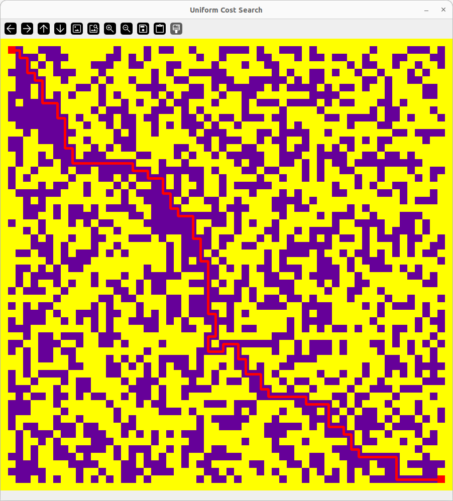
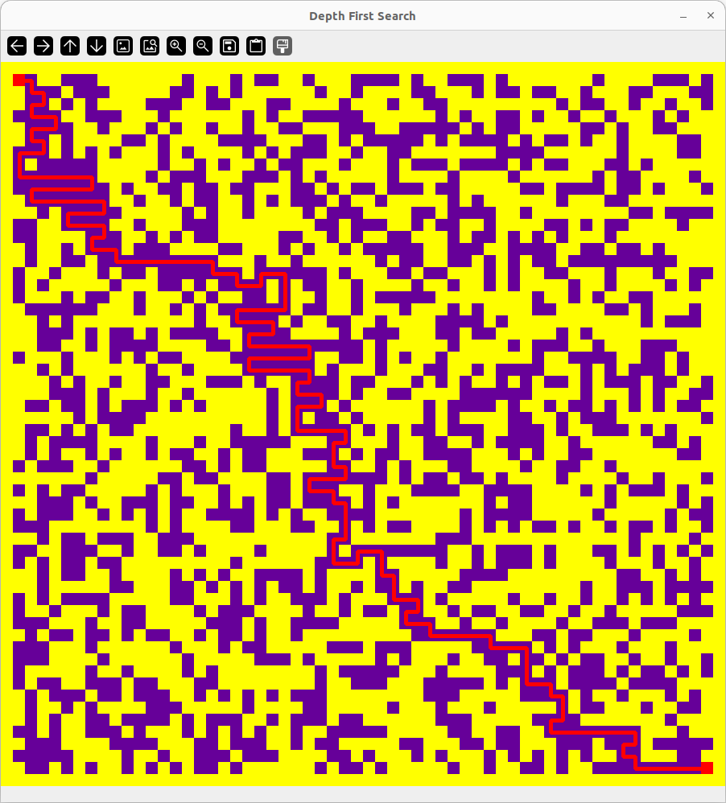
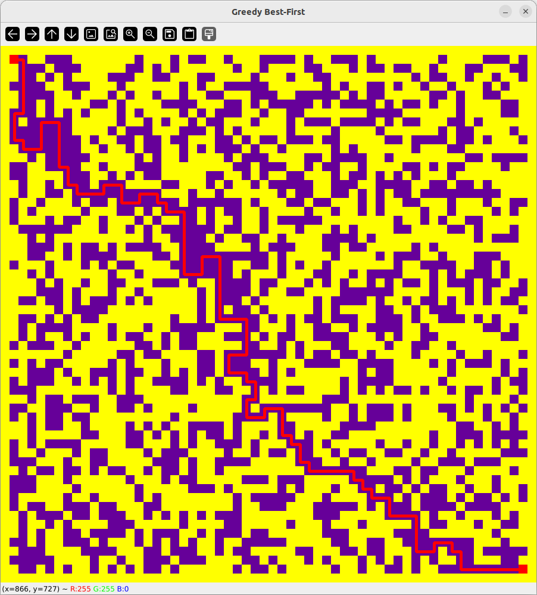
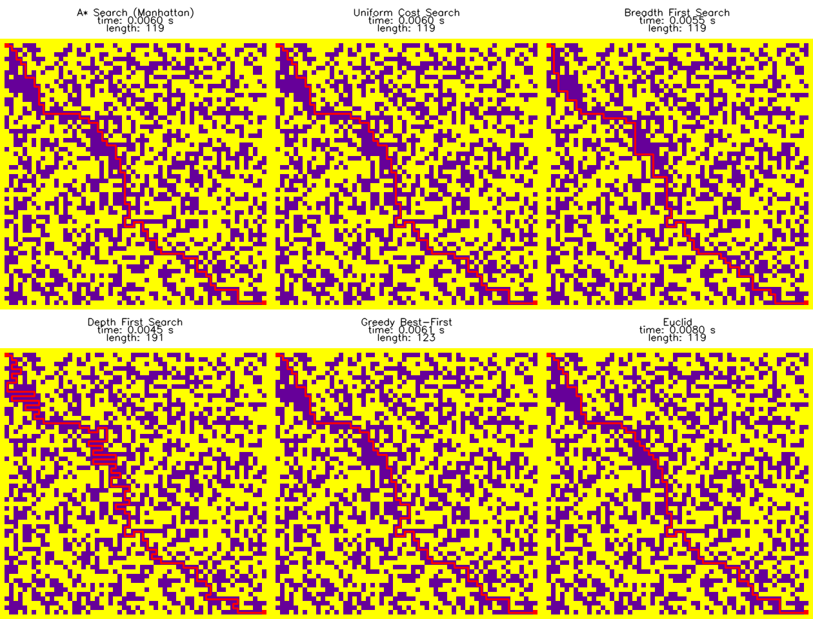

# IA2025F: 2025-2 인공지능입문(다)반 팀 프로젝트
## 프로젝트 요약
#### 기여자
justkiwon: A*(Euclid, Manhattan), UCS 구현  
kchsugo: DFS, Floyd-Warshall, IDDFS 구현  
shagyeong: 시각화, 좌수법 구현, 프로젝트 문서화  
jaeseung0228: BFS, Greedy BFS 구현  
#### main.py
프로젝트 파일 시스템 내 모듈을 호출하여 동작  
수행 알고리즘: A*, UCS, DFS, BFS, Greedy BFS  
```
$ tree .
├── main.py
├── modules
│   ├── Euclid.py
│   ├── IdDfs.py
│   ├── Maps.py
│   ├── UCS.py
│   ├── Visualize.py
│   ├── __pycache__
│   ├── astar.py
│   ├── bfs.py
│   ├── dfs.py
│   ├── floyd.py
│   ├── greedy.py
│   └── lefthand.py
$ python3 main.py
```
|A*|UCS||
|---|---|---|
||||
|**DFS**|**BFS**|**Greedy BFS**|
||||
#### main_total.py
제출용 단일 .py 파일(모든 모듈을 하나의 파일에 정의하여 동작)  
수행 알고리즘: A*(Manhattan), A*(Euclid), UCS, BFS, DFS, Greedy BFS  
```
$ tree .
├── main_total.py
├── map.txt
└── result_path.png
$ python3 main_total.py
```



<!-- ## 구현 알고리즘 -->


<!--
## 시각화
#### colorize(): 맵 색상화
```
def colorize(src,size)->np.array:
```
src: 원본 맵 *리스트* - 0, 1, "S", "G"로 표현  
size: 정방형 맵 사이즈(60x60 맵일 경우 60 전달)  
#### upscale(): 맵 업스케일
```
def upscale(src,size,scale)->np.array:
```
src: 원본 맵 행렬 영상  
size: 정방형 맵 사이즈(60x60 맵일 경우 60 전달)  
scale: 업스케일링 배율  
|맵 원본|15배 업스케일 맵|
|---|---|
|||
#### drawpath(): 정답열 시각화
```
def drawpath(src,ans,scale,thcikness)->None:
```
src: 업스케일된 맵 행렬 영상  
ans: 정답열 열거형(np.array)  
scale: 업스케일링 배율  
thickness: 선 굵기
|맵 원본|경로가 표시된 맵(선 굵기 3)|
|---|---|
|||
-->
