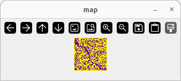
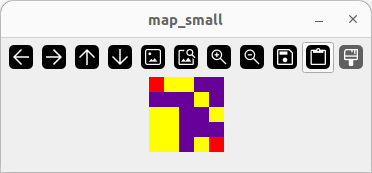
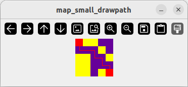

# IA2025F: 2025-2 인공지능입문(다)반 팀 프로젝트
<!-- astar -->
<!-- bfs -->
<!-- dfs -->
## 시각화
#### opencv.py 실행
```
$ python3 opencv.py
```
#### upscale(): 맵 업스케일
```
def upscale(src,size,scale)->np.array:
```
src: 원본 맵 행렬 영상  
size: 정방형 맵 사이즈(60x60 맵일 경우 60 전달)  
scale: 업스케일링 배율  
|맵 원본|15배 업스케일 맵|
|---|---|
|||
#### drawpath(): 정답열 시각화
```
def drawpath(src,ans,scale,thcikness)->None:
```
src: 업스케일된 맵 행렬 영상  
ans: 정답열 열거형(np.array)  
scale: 업스케일링 배율  
thickness: 선 굵기
|맵 원본|경로가 표시된 맵(선 굵기 3)|
|---|---|
|||
